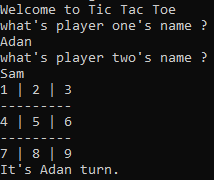
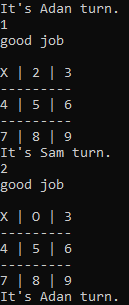
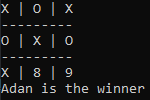
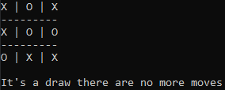

# Tic-Tac-Toe

This project was dived into 4 different milestones each one intended to make us practice different things on Ruby but the main topic to learn was OOP (Object Oriented Programming).
## Screenshot showcasing the gameplay.

## Built with:
- Ruby
- Rubocop

## Milestones:
- Setup
- User interface
- Game logic
- Instructions for players

## Basic game rules:
1. The game is played on a grid that's 3 squares by 3 squares.
2. Players take turns putting their marks in empty squares.
3. The first player to get 3 of her marks in a row (up, down, across, or diagonally) is the winner.
4. When all 9 squares are full, the game is over. If no player has 3 marks in a row, the game ends in a tie.

## Steps for you to play our game:
- Clone this repository by opening your terminal and run:
  git [clone](https://github.com/SigmaSam/Tic-Tac-Toe-Microverse..git)
- Then run move to where the main is located by running:
  `cd ..Tic-Tac-Toe-Microverse/bin`
- Finally just run the main file using:
  `ruby main`
- Enjoy out Tic Tac Toe made with Ruby.

## Steps to validate code using out Rspec file
- Once you have clone the repository make sure that you have Rspec install by running rspec --version
- If you do not have Rspec installed do so by following the Instructions [here](https://medium.com/@amliving/my-rails-rspec-set-up-6451269847f9)
- Then move to the directory spec and run this comand 'rspec tic_tac_toe_spec.rb'

## Authors

👤 **Samuel Almao**
- Github: [@SigmaSam](https://github.com/SigmaSam)

👤 **Adan Fernandez**
- Github: [@balerum03](https://github.com/balerum03)

## Contributing
Bug reports and pull requests are welcome on GitHub at [this](https://github.com/SigmaSam/Tic-Tac-Toe-Microverse.)

## License
The gem is available as open source under the terms of the [MIT License](https://opensource.org/licenses/MIT).
